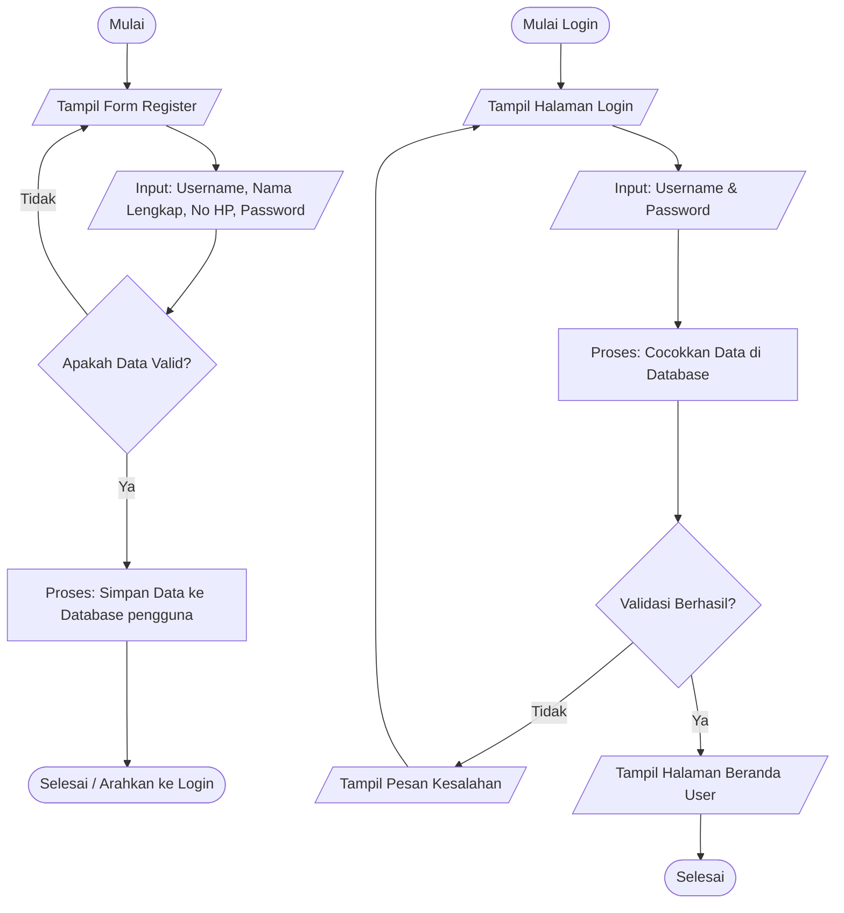
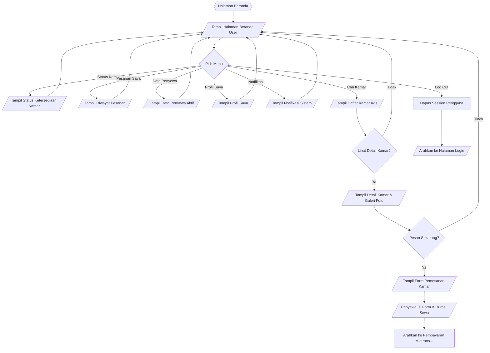

# Evaluasi dan Panduan Perbaikan Flowchart Sistem - Kos Berkah Malika

Dokumen ini berisi tinjauan detail terhadap flowchart **Register**, **Login User**, dan **Beranda User** yang Anda lampirkan, disesuaikan dengan standar simbol flowchart pada **Gambar 4**.

---

## 1. Ringkasan Hasil Analisis

Secara keseluruhan, **logika alur berpikir** pada flowchart Anda sudah terstruktur dengan sangat baik dan mudah dipahami. Namun, terdapat beberapa **ketidaksesuaian penggunaan simbol** jika merujuk pada standar aturan flowchart (Gambar 4). 

Di bawah ini adalah poin-poin penting yang perlu diperbaiki agar flowchart Anda memenuhi standar penulisan yang benar (misalnya untuk kebutuhan laporan praktikum, skripsi, atau dokumentasi resmi).

---

## 2. Tinjauan Detail per Modul

### A. Flowchart Register (Gambar 1)
*   **Input Username, Nama, Nomor HP, Password**:
    *   *Kondisi Sekarang*: Menggunakan simbol **Persegi Panjang** (Proses).
    *   *Analisis (Gambar 4)*: Aktivitas memasukkan data oleh pengguna adalah proses **Input Data**. Berdasarkan standar Gambar 4, simbol untuk input/output data adalah **Jajaran Genjang**.
    *   *Saran Perbaikan*: Ubah simbol kotak input tersebut menjadi **Jajaran Genjang**.
*   **Alur Akhir (Setelah Simpan Ke Database)**:
    *   Logika register biasanya berakhir setelah data tersimpan, lalu diarahkan ke halaman login. Keberadaan proses "Login" di dalam alur register sebelum "Selesai" dapat membingungkan karena Login memiliki flowchart tersendiri.
    *   *Saran*: Dari "Simpan Ke Database", alirkan langsung ke simbol **Selesai** (atau hubungkan ke halaman login menggunakan *Off Page Connector*).

---

### B. Flowchart Login User (Gambar 2)
*   **Input Username dan Password**:
    *   *Kondisi Sekarang*: Menggunakan simbol **Persegi Panjang** (Proses).
    *   *Analisis*: Ini adalah proses **Input**, maka harus menggunakan simbol **Jajaran Genjang** (Input/Output).
*   **Tampil Kesalahan (di bawah jalur Validasi -> Tidak)**:
    *   *Kondisi Sekarang*: Menggunakan simbol **Persegi Panjang** (Proses).
    *   *Analisis*: Menampilkan pesan error di layar pengguna adalah bentuk **Output Data / Informasi**. Berdasarkan Gambar 4, output harus menggunakan simbol **Jajaran Genjang**.

---

### C. Flowchart Beranda User (Revisi Terbaru)
Pada revisi terbaru yang Anda kirimkan, **logika alur sudah sepenuhnya benar**:
*   **Logika Cari Kamar -> Lihat Detail [SUDAH BENAR]**:
    *   *Kondisi Sekarang*: Jika "Lihat Detail" bernilai **Ya**, flowchart mengalir ke kotak **"Tampil detail kamar"**. Ini **sangat tepat** karena pengguna memang diarahkan ke halaman detail spesifik kamar tersebut, bukan daftar kamar lagi.
*   **Penggunaan Simbol Rumah Terbalik (Off Page Connector) [Perlu Diperbaiki]**:
    *   *Kondisi Sekarang*: Langkah "Tampil status ketersediaan kamar", "Tampil Riwayat Pesanan", "Tampil Data Penyewa", "Tampil Profil Saya", dan "Tampil Notifikasi" masih menggunakan simbol **Off Page Connector** (segi lima terbalik).
    *   *Analisis (Gambar 4)*: Simbol *Off Page Connector* hanya digunakan untuk **menghubungkan alur flowchart yang terputus ke halaman lain**. Menampilkan data atau halaman informasi di layar adalah aktivitas **Output**, sehingga simbol yang benar adalah **Jajaran Genjang**.
*   **Penggunaan Simbol Persegi Panjang pada Aksi Output [Perlu Diperbaiki]**:
    *   Langkah "Tampil daftar Kamar", "Tampil detail kamar", dan "Tampil Form Pesan" menggunakan **Persegi Panjang** (Proses). Karena ketiganya adalah proses menampilkan komponen visual (Output), simbolnya harus berupa **Jajaran Genjang**.

---

## 3. Tabel Panduan Perbaikan Simbol

Berikut adalah rangkuman perubahan simbol yang direkomendasikan berdasarkan aturan pada **Gambar 4**:

| Aktivitas di Flowchart Anda | Simbol Saat Ini | Simbol yang Seharusnya (Gambar 4) | Alasan |
| :--- | :---: | :---: | :--- |
| **Input data oleh user** (Input username, password, nomor hp, dll) | Persegi Panjang (Proses) | **Jajaran Genjang** (Input/Output) | Merupakan proses memasukkan parameter/data ke dalam sistem. |
| **Menampilkan data/halaman** (Tampil Kesalahan, Tampil daftar Kamar, Tampil Form Pesan) | Persegi Panjang (Proses) | **Jajaran Genjang** (Input/Output) | Merupakan proses menyajikan informasi/output ke layar pengguna. |
| **Tampil Detail/Status/Profil** (Pada menu Beranda) | Off Page Connector (Segi lima terbalik) | **Jajaran Genjang** (Input/Output) | *Off Page Connector* hanya untuk penghubung halaman. Menampilkan data profil/status adalah output informasi. |

---

## 4. Rekomendasi Kode Mermaid Flowchart yang Benar

Anda dapat menggunakan kode Mermaid di bawah ini sebagai referensi visual yang sudah diperbaiki secara logika dan simbol sesuai standar sistem Anda saat ini:

### Flowchart Register & Login (Gabungan Logis)

### Flowchart Beranda User (Navigasi Menu & Pemesanan)

