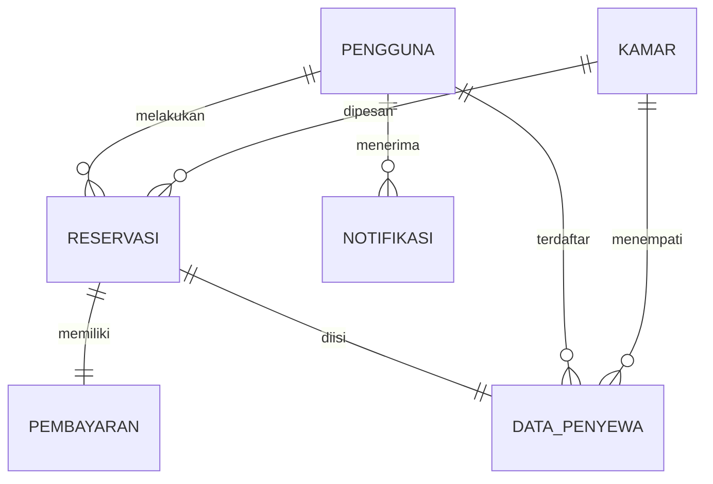
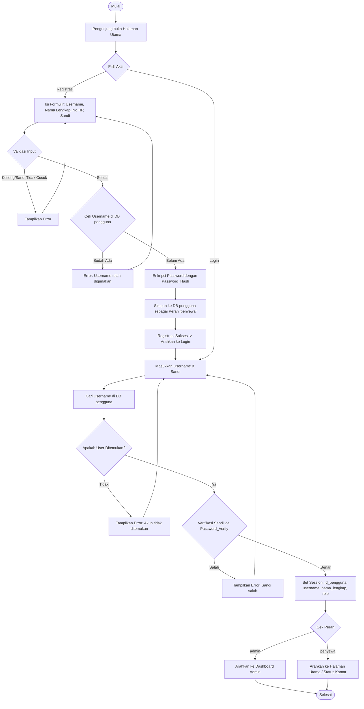
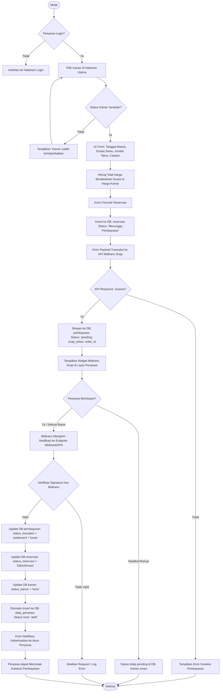
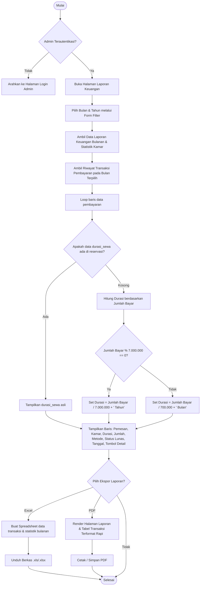

# Analisis Sistem & Alur Kerja (Flowchart) - Kos Berkah Malika

Dokumen ini berisi analisis mendalam mengenai arsitektur sistem, struktur database, serta pemodelan alur kerja (flowchart) untuk aplikasi **Sistem Informasi Reservasi dan Pembayaran Kos Berkah Malika**.

---

## 1. Ikhtisar Sistem (System Overview)

Aplikasi **Kos Berkah Malika** adalah platform berbasis web untuk mempermudah pengelolaan kamar kos, proses reservasi oleh penyewa, pembayaran digital terintegrasi (Midtrans), dan pelaporan keuangan terotomatisasi bagi pengelola (Admin).

### Aktor Utama & Hak Akses
1. **Penyewa (Tenant)**:
   - Melihat daftar kamar kos yang tersedia (lantai, harga bulanan/tahunan, spesifikasi, galeri foto).
   - Melakukan pendaftaran (registrasi) dan masuk (login) menggunakan username unik tanpa memerlukan email.
   - Melakukan reservasi kamar secara online dengan memilih durasi sewa (Bulan/Tahun).
   - Membayar pesanan secara real-time via payment gateway **Midtrans** (QRIS, Transfer Bank, dll).
   - Melihat riwayat transaksi pembayaran dan mengunduh kuitansi digital.
   - Mengelola profil pribadi.

2. **Administrator (Admin)**:
   - Mengelola inventaris kamar kos (tambah, edit, hapus, update foto & spesifikasi).
   - Mengelola reservasi penyewa (konfirmasi manual atau pembatalan).
   - Menambahkan reservasi secara offline langsung dari panel admin.
   - Mengelola pembayaran masuk (melihat status Midtrans & melakukan verifikasi).
   - Mengakses Dashboard statistik interaktif (grafik pendapatan 12 bulan terakhir).
   - Mengakses Laporan Keuangan lengkap dengan fitur **Riwayat Transaksi** detail (dilengkapi kolom durasi & aksi).
   - Mengekspor laporan bulanan ke format **Excel** dan **PDF**.
   - Mengelola akun pengguna (CRUD Pengguna).

---

## 2. Analisis Struktur Database (Schema Database)

Sistem ini didukung oleh database relasional MySQL dengan 7 tabel utama yang saling berelasi:

### Detail Relasi & Integritas Data
1. **`pengguna`**: Menyimpan data login & profil. Fitur email telah sepenuhnya dihapus. Identifikasi bergantung pada kolom `username` (Unique) dan `nama_lengkap`.
2. **`kamar`**: Menyimpan detail harga (`harga_per_bulan` & `harga_per_tahun`), spesifikasi fisik, lantai, status (`tersedia`, `terisi`, `perbaikan`), dan galeri multi-foto.
3. **`reservasi`**: Menyimpan transaksi sewa. Menghubungkan penyewa dengan kamar terpilih, menyimpan tanggal masuk/keluar, total harga, durasi (`durasi_sewa`), dan status (`Menunggu Pembayaran`, `Menunggu`, `Dikonfirmasi`, `Dibatalkan`, `Selesai`).
4. **`pembayaran`**: Menyimpan data detail pembayaran online yang terhubung ke Midtrans via `token_snap` dan melacak `status_transaksi` (`pending`, `settlement`, `capture`, `expire`, `cancel`, `deny`).
5. **`data_penyewa`**: Menyimpan informasi penghuni aktif yang mencakup NIK/KTP, pekerjaan, dan masa sewa aktif.
6. **`notifikasi`**: Sistem pesan log untuk memberi tahu pengguna tentang status reservasi & pembayaran.
7. **`laporan_keuangan`**: Entri rekap bulanan pendapatan kotor, jumlah kamar terisi/kosong untuk dokumentasi internal.

---

## 3. Alur Kerja Sistem (Flowcharts)

Berikut adalah pemodelan alur kerja sistem menggunakan diagram alir (flowchart) terperinci untuk setiap modul utama.

### A. Alur Pendaftaran & Autentikasi (Registrasi & Login)
Alur ini memastikan proses autentikasi aman tanpa menggunakan email, dengan memvalidasi keunikan username di database.

---

### B. Alur Pemesanan Kamar & Pembayaran Online (Midtrans Snap Gateway)
Proses penanganan pemesanan online oleh penyewa yang terintegrasi secara real-time dengan payment gateway Midtrans.

---

### C. Alur Laporan Keuangan & Riwayat Transaksi (Sisi Admin)
Alur administrasi pengelolaan laporan keuangan, rekap penjualan, penentuan durasi sewa secara otomatis, dan opsi ekspor dokumen.

---

## 4. Keunggulan Desain Arsitektur Sistem saat Ini

Sistem ini telah diperbaiki dan dimodifikasi dengan standar industri modern yang andal:
1. **Pemisahan Peran yang Jelas**: Autentikasi ketat memisahkan antarmuka administrasi dan portal penyewa secara aman.
2. **Fleksibilitas Durasi**: Mampu mengalkulasi sewa bulanan dan tahunan secara dinamis dan memiliki kecerdasan buatan (*fallback logic*) untuk mendeteksi durasi sewa berdasarkan harga yang terbayar di laporan.
3. **Pembayaran yang Handal**: Menggunakan **Midtrans Snap SDK** di frontend dan validasi backend yang aman menggunakan `signature_key` untuk memblokir manipulasi status pembayaran.
4. **Peningkatan Antarmuka Premium**: Tampilan tabel riwayat transaksi pada panel laporan telah dibersihkan (menghapus kolom sekunder seperti kode order agar ramah perangkat mobile), ditambahkan kolom durasi langsung, disinkronkan warnanya, serta diposisikan secara presisi agar bebas dari tumpang tidal tata letak.
