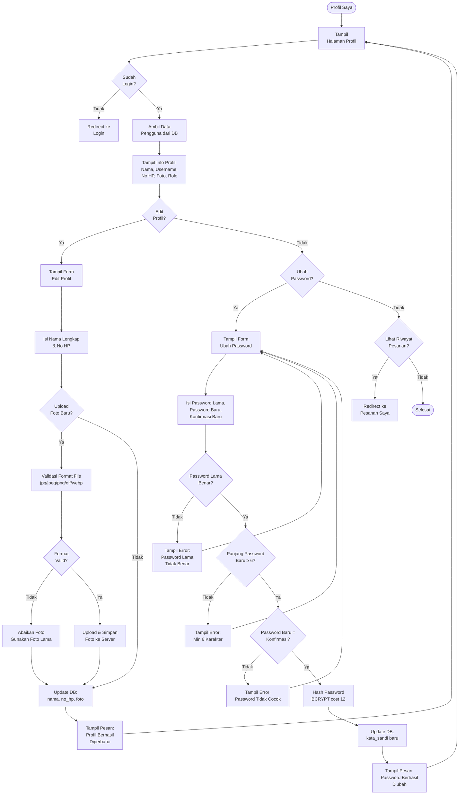

# Flowchart Profil Saya - Kos Berkah Malika

## Flowchart Halaman Profil User

---

## Keterangan Alur

| Simbol | Arti |
|--------|------|
| `([...])` | Terminal (Mulai / Selesai) |
| `[...]` | Proses / Aksi |
| `{...}` | Keputusan (Decision) |

## Penjelasan Tiap Alur

### 1. Cek Login
Saat user membuka halaman `profil.php`, sistem langsung mengecek session. Jika belum login, langsung diarahkan ke halaman login.

### 2. Tampil Data Profil
Sistem mengambil data dari tabel `pengguna` berdasarkan `id_pengguna` dari session, lalu menampilkan:
- Foto profil (atau avatar otomatis jika belum ada)
- Nama lengkap & username
- Nomor HP
- Role (penyewa)
- Tanggal bergabung

### 3. Edit Profil
User dapat mengubah:
- **Nama Lengkap** — wajib diisi
- **Nomor HP** — opsional
- **Foto Profil** — upload file gambar (jpg, jpeg, png, gif, webp)

Jika foto baru diupload, sistem memvalidasi format file. Jika valid, file disimpan ke `public/uploads/profil/` dengan nama unik `profil_{id}_{timestamp}.ext`.

### 4. Ubah Password
Validasi dilakukan secara bertahap:
1. Password lama harus cocok dengan hash di DB (BCRYPT verify)
2. Password baru minimal 6 karakter
3. Konfirmasi password harus sama dengan password baru

Jika semua valid, password baru di-hash dengan BCRYPT cost 12 dan disimpan ke DB.

### 5. Riwayat Pesanan
Tombol shortcut untuk langsung menuju halaman `pesanan_saya.php`.
