# Flowchart Sistem Kos Berkah Malika

## 1. Flowchart Utama Sistem (Overview)

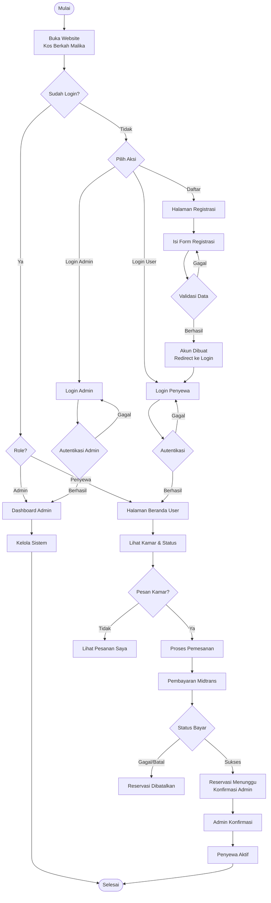

---

## 2. Flowchart Registrasi User

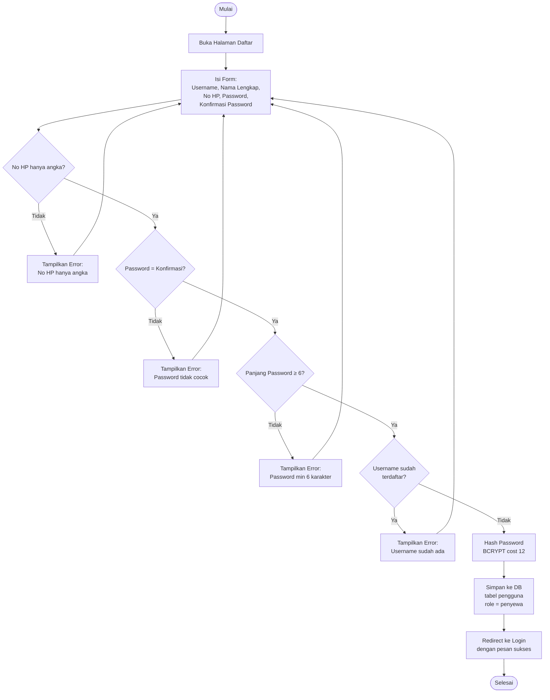

---

## 3. Flowchart Login

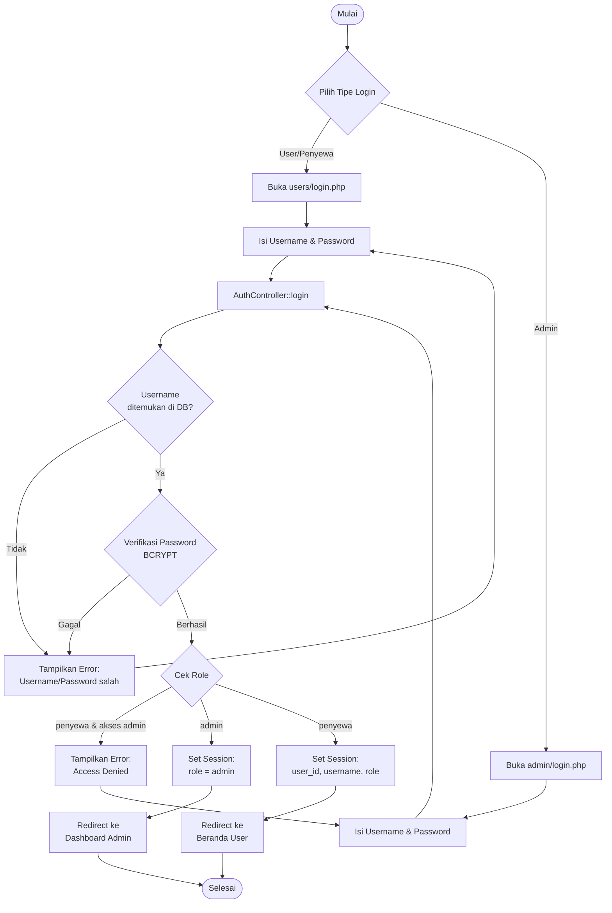

---

## 4. Flowchart Pemesanan Kamar (User)

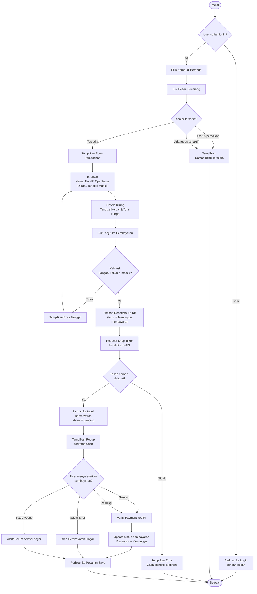

---

## 5. Flowchart Konfirmasi Reservasi (Admin)

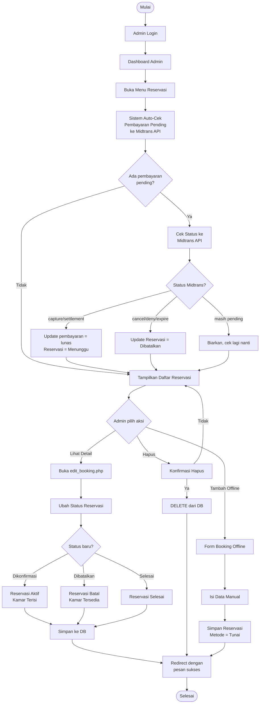

---

## 6. Flowchart Pembayaran (Admin)

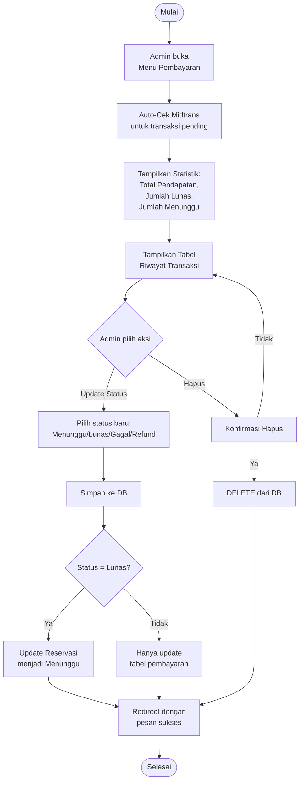

---

## 7. Flowchart Beranda User (Status Kamar & Lihat Kamar)

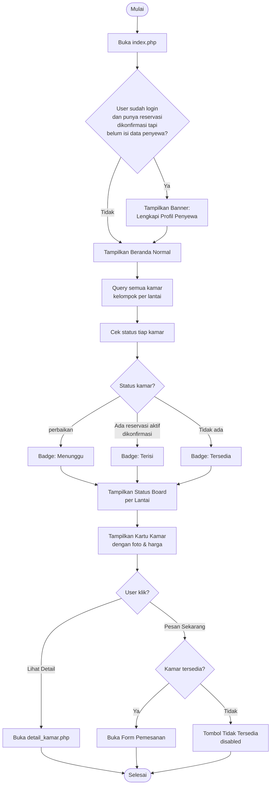

---

## 8. Flowchart Pesanan Saya (User)

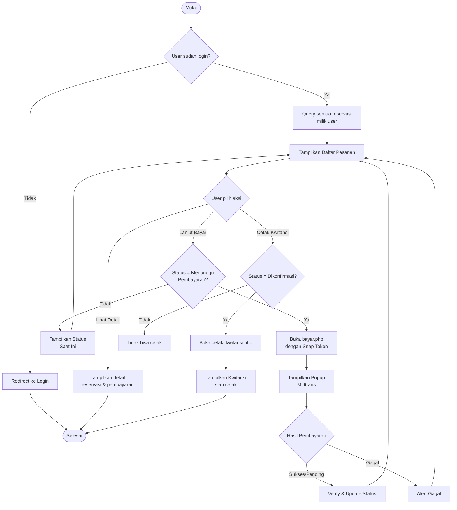

---

## 9. Flowchart Kelola Kamar (Admin)

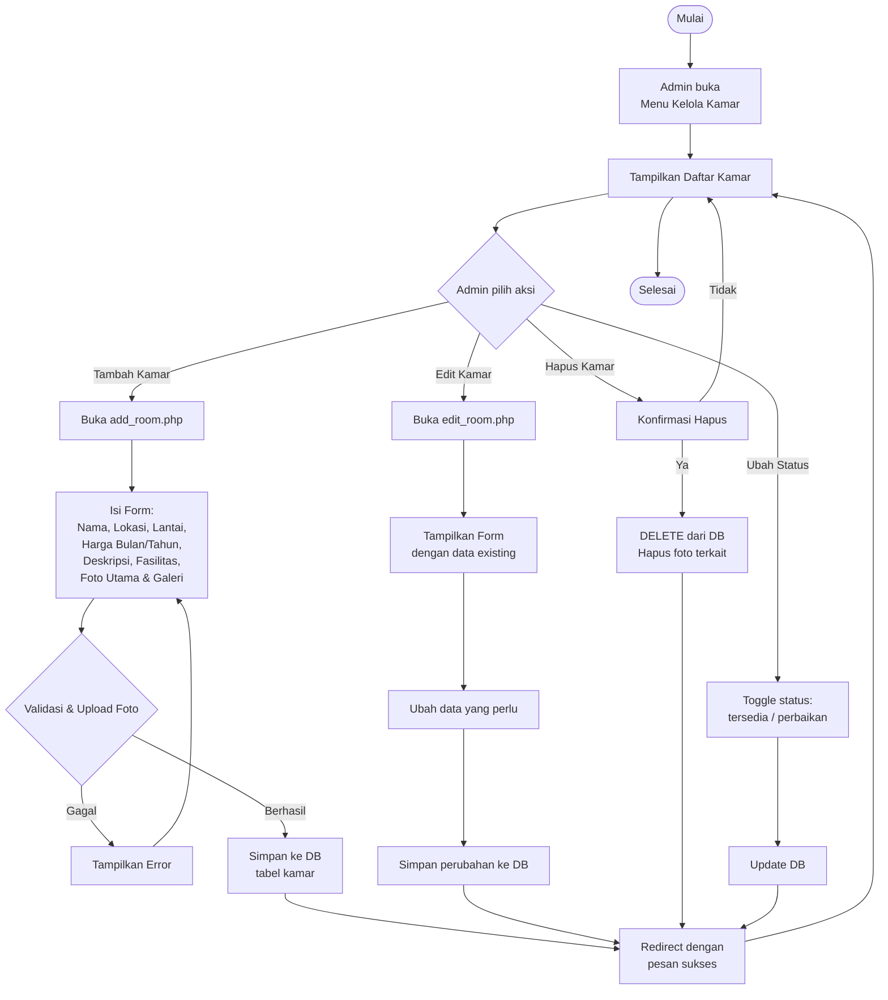

---

## 10. Flowchart Logout

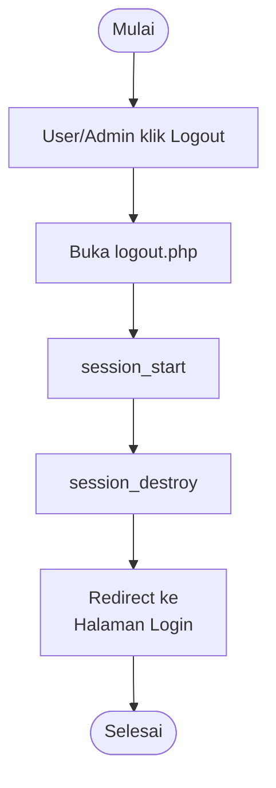

---

## 11. Flowchart Profil Saya (User)

> Gaya flowchart mengikuti format standar dengan diamond (keputusan) dan kotak (proses), seperti pada contoh Flowchart Beranda Pembeli.

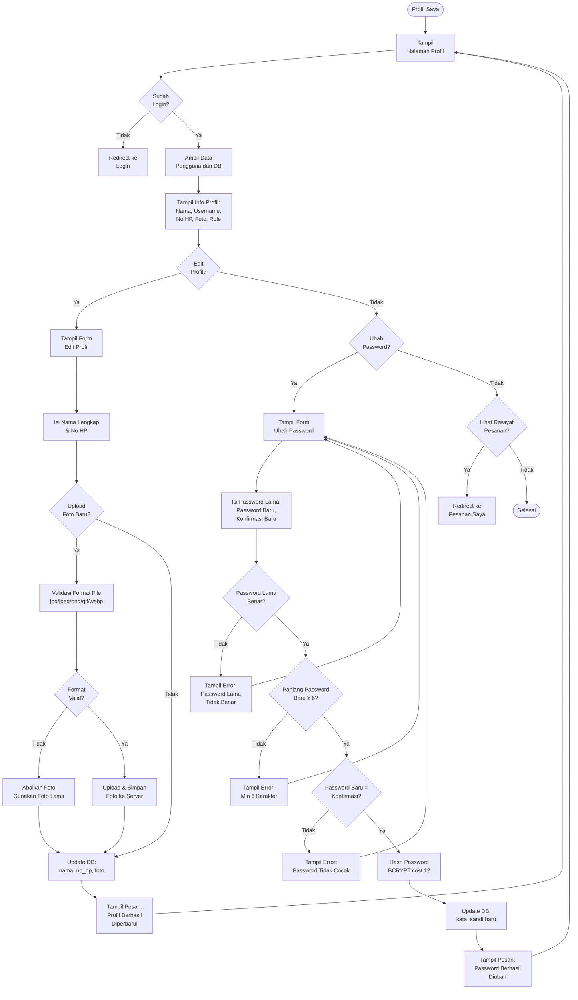

---

## Ringkasan Alur Sistem

| No | Modul | Aktor | Deskripsi |
|----|-------|-------|-----------|
| 1 | Registrasi | User | Daftar akun baru dengan validasi username unik & password |
| 2 | Login | User / Admin | Autentikasi berbasis role dengan BCRYPT |
| 3 | Beranda | User | Lihat status kamar real-time & daftar kamar tersedia |
| 4 | Pemesanan | User | Isi form, hitung harga otomatis, bayar via Midtrans |
| 5 | Pembayaran | User | Proses via Midtrans Snap (Transfer, E-Wallet, QRIS) |
| 6 | Pesanan Saya | User | Pantau status reservasi & cetak kwitansi |
| 7 | Dashboard | Admin | Statistik kamar, penyewa aktif, pesanan pending, pendapatan |
| 8 | Kelola Reservasi | Admin | Konfirmasi, tolak, atau hapus reservasi |
| 9 | Kelola Pembayaran | Admin | Monitor & update status transaksi |
| 10 | Kelola Kamar | Admin | CRUD kamar beserta foto & fasilitas |
| 11 | Data Penyewa | Admin | Lihat & kelola data lengkap penyewa |
| 12 | Laporan | Admin | Export laporan pendapatan & reservasi |
| 13 | Logout | User / Admin | Hapus session & redirect ke login |
